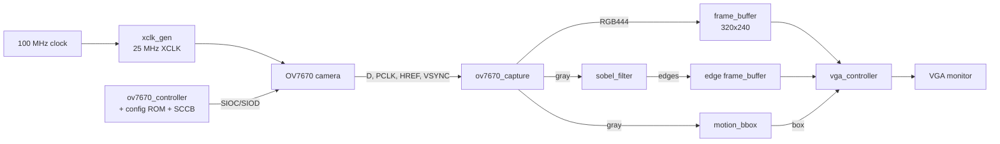

# OV7670 Camera Vision Pipeline on FPGA (VHDL)

Real-time video pipeline written in VHDL that captures images from an **OV7670 camera**, processes them on the FPGA, and displays the result on a **VGA monitor** (640×480 @ 60 Hz).

The design supports four display modes (color, grayscale, Sobel edges, thresholded edges) and hardware **motion detection** with a bounding box drawn over the moving object.

Target board: **Digilent Nexys A7-100T** (Xilinx Artix-7 XC7A100T), 100 MHz system clock, 12-bit VGA output.

---

## Features

- **Camera configuration over SCCB** (I²C-like protocol) from a register ROM, including soft reset and a 1 ms settle delay
- **Pixel capture** from the OV7670 in RGB565, converted to RGB444 (12-bit) and 8-bit grayscale
- **2× decimation**: 640×480 camera frame stored as 320×240 in block RAM
- **Dual-clock frame buffer** (camera `pclk` domain → VGA 25 MHz domain)
- **Sobel edge detector** with two line buffers and a 3×3 sliding window
- **Motion detection** by frame differencing, with a bounding box computed per frame
- **VGA controller** with 2× upscaling and overlay of up to two bounding boxes

## Display modes

| `mode` | Output |
|--------|--------|
| `00`   | Color (RGB444) |
| `01`   | Grayscale |
| `10`   | Sobel edge magnitude |
| `11`   | Binary edges (white where edge > `threshold`, else black) |

Bounding box overlays: **box A** is drawn in green, **box B** in blue.

---

## Architecture



## Source files

| File | Description |
|------|-------------|
| `xclk_gen.vhd` | Divides the 100 MHz clock by 4 to produce the 25 MHz camera clock (XCLK) |
| `ov7670_config_rom.vhd` | ROM of OV7670 register/value pairs (`x"FFFF"` marks the end) |
| `sccb_master.vhd` | SCCB write master (device ID `0x42`, 100 kHz), 3-phase write: ID, register, data |
| `ov7670_controller.vhd` | FSM that reads the ROM and sends each register through the SCCB master |
| `ov7670_capture.vhd` | Assembles RGB565 bytes into pixels, outputs RGB444 + grayscale, write address and enable |
| `line_buffer.vhd` | Shift-style line delay (default 320 pixels) used by the Sobel filter |
| `frame_buffer.vhd` | Dual-clock, dual-port block RAM (default 76 800 × 12 bits) |
| `sobel_filter.vhd` | 3×3 Sobel operator, outputs `|Gx| + |Gy|` saturated to 8 bits with its address |
| `motion_bbox.vhd` | Compares each pixel with the previous frame and outputs the motion bounding box |
| `vga_controller.vhd` | 640×480 timing generator, mode selection, 2× upscaling, box overlay |

---

## Implementation details

**Grayscale conversion** (in `ov7670_capture`) uses the integer approximation

```
Y = (77·R + 150·G + 29·B) >> 8
```

**Motion detection** (in `motion_bbox`):
- A pixel is "moving" when `|current − previous| ≥ DIFF_MIN` (default 40)
- The box is updated only when at least `MIN_PIX` moving pixels are found (default 200)
- Detection is disabled for the first frames after reset so the previous-frame memory is filled first

**VGA timing** (25 MHz pixel clock):

| Parameter | Horizontal | Vertical |
|-----------|-----------|----------|
| Visible   | 640 | 480 |
| Front porch | 16 | 10 |
| Sync pulse  | 96 | 2 |
| Back porch  | 48 | 33 |
| Total       | 800 | 525 |

## Generics

| Module | Generic | Default |
|--------|---------|---------|
| `sccb_master` | `CLK_FREQ_HZ`, `SCCB_FREQ_HZ` | 100 MHz, 100 kHz |
| `ov7670_controller` | `CLK_FREQ_HZ` | 100 MHz |
| `line_buffer` | `DEPTH` | 320 |
| `frame_buffer` | `DATA_WIDTH`, `DEPTH` | 12, 76 800 |
| `sobel_filter` | `WIDTH`, `HEIGHT` | 320, 240 |
| `motion_bbox` | `WIDTH`, `HEIGHT`, `DIFF_MIN`, `MIN_PIX` | 320, 240, 40, 200 |

---

## Getting started

1. Create a new Vivado project for the Nexys A7-100T (`xc7a100tcsg324-1`).
2. Add all `.vhd` files as design sources.
3. Add a top-level entity that instantiates and connects the modules.
4. Add an `.xdc` constraints file with the pins for the clock, reset, switches, VGA port, and the Pmod headers wired to the OV7670.
5. Run synthesis, implementation, and generate the bitstream.

> **Status:** the processing modules are complete. The top-level entity and the constraints file are not included yet.

## Hardware

- Digilent Nexys A7-100T
- OV7670 camera module (without FIFO), connected via Pmod headers
- VGA monitor and cable

## Author

**Sereyvicheka** — M2 Electronic Systems (ESECA), Toulouse INP – ENSEEIHT
